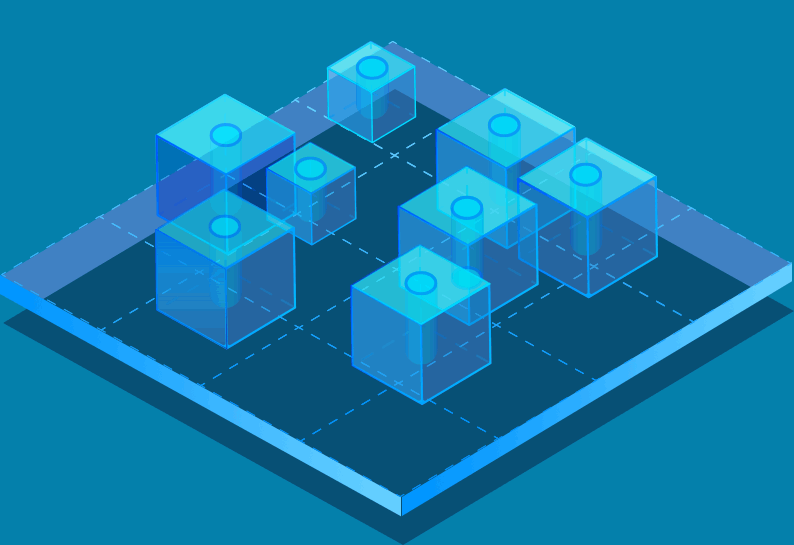
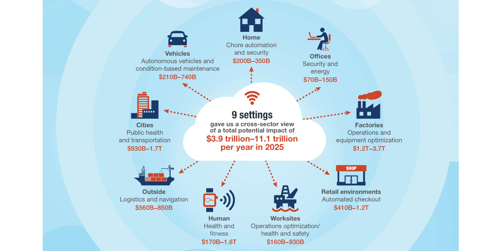
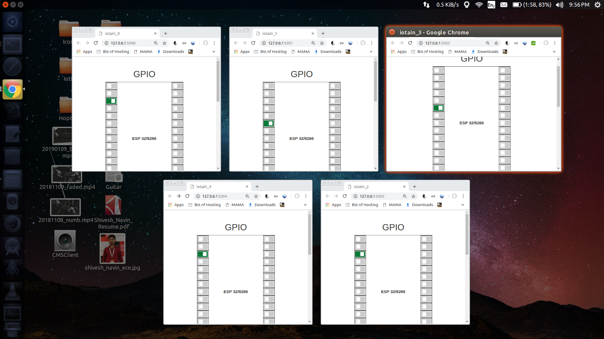
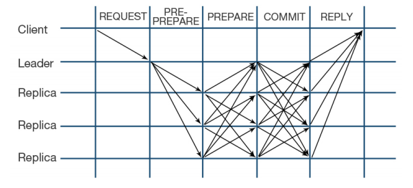
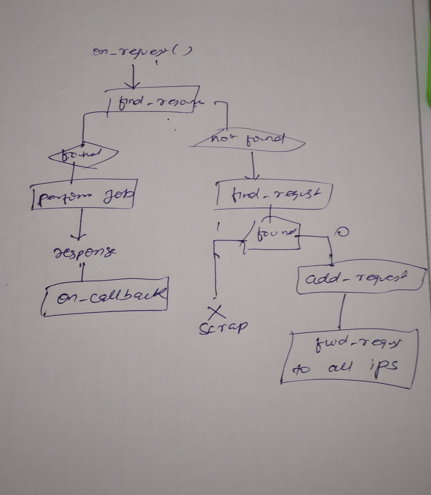
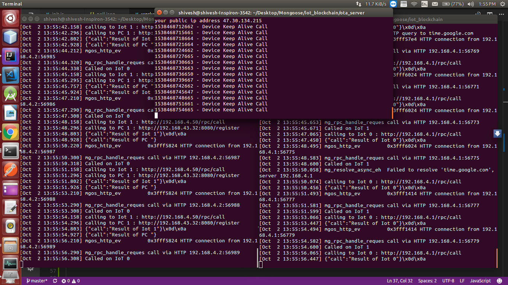

# IoTain
College Minor & Major project on Implementation of IoT using Blockchain

 

IoTain is developed as a lite operating system using the blockchain concept and implementing PBFT, SPV and CPS technology, allowing data to be layered and stored in a decentralised manner and providing protection with the combined strength of the millions of IoT nodes within the network.

The technology will result in an economy of sharing for Internet of Things (IoT) devices in a decentralized and energy efficient environment while producing a wealth of valuable user data which can be used as fuel for the development of AI with users rewarded for providing this fuel.

 

Under this network, the interconnection of IoT devices of a home, a business or even a city can truly flourish without worry of transfer congestion, malicious attacks or losing privacy.

## Hardware

5 PCB Modules Break Down ---> 

1. ESP32_0 Connects to MQTT Cloud , TouchPad(RID: 2015) 
2. ESP8266_1 Use only as Router
3. ESP32_2 Connects to LCD via I2C(RID: 2016) , LED (RID: 2017)
4. ESP8266_3 Use only as Router
5. ESP32_4 Connects to Human Detector(RID: 2019) / Arduino(RID: 2018)

### NodeMCU - ESP32 
https://www.espressif.com/sites/default/files/documentation/esp32_datasheet_en.pdf

Manufacturer	Espressif Systems
Type	Microcontroller
Release date	September 6, 2016
CPU	Tensilica Xtensa LX6 microprocessor @ 160 or 240 MHz
Memory	520 KiB SRAM
Power	3.3 V DC

Peak Current at Startup - 330mA @3.3V / 5V
Normal Mode - 40mA / 295mA while transmitting


### NodeMCU - ESP8266-12E 4M Flash

Manufacturer	Espressif Systems
Type	32-bit microcontroller
CPU	@ 80 MHz (default) or 160 MHz
Memory	32 KiB instruction, 80 KiB user data
Input	16 GPIO pins

Peak Current at Startup - 330mA @3.3V / 5V
Normal Mode - 40mA / 295mA while transmitting

REF: https://www.esp8266.com/viewtopic.php?f=13&t=3875

### LCD 
Current : 30-60mA
Voltage : 5V


## Module 0: Emulator  

https://github.com/shiveshnavin/iot_blockchain_exps

https://docs.google.com/spreadsheets/d/1eNXbXkoAlzQ8lPaVAfOieuCQz-jQHsp9ouRmxi8EvYQ/edit?usp=sharing


To Run on Windows

```code
double click run.bat
```

To run on Linux
```code
./run.sh
```

To make a request 

run ota_server and send postman or from GUI request 
```code

http://127.0.0.1:5001/rpc/on_request

{
	
	"req_id":"123",
	"src_ip":"127.0.0.1:8080",
	"status":{"message":"under process"},
	"job":{"res_id":61,"res_name":"Ultrasound sensor","action":"read"}
	
}

```



  


## Module 1: Resources 

### Capacitive Touch : IoT Potato Controlled Drum Player  ( 24/9/18 )
#### Demo Video : CLICK IMAGE TO OPEN 
[](https://www.youtube.com/watch?v=ghmBqej5D24 "Video : IoT Drum Player : Potato Version")

### Individual Human Detector 

Detects a particular person when in vicinity .

## Module 2: Resource Discovery 

 

### Internetwork Communication (CORE)  ( 02/10/18 )
To make HTTP calls from once device routed through AP and that Routed through STA mode when device is working in AP+STA mode . This will be used for Chaining Up multiple devices , request forwarding and Callbacking [See Test 2]


### Implement Intercom functions (CORE)
Write RPC listeners to listen to requests , check whether resource in avalable , if available  pass the request to resource access controller else pass the request to other devices .

Implement
```code
on_request()
on_callback()
on_resource()

```
### Resource Registry
Make a table of resources availble on a device 

## Module 3: Network Structure Creation

### WiFi Status LED behaviour (17/10/18)
LED at pin 5 in blinking state when WiFi is connecting or disconnected and Solid ON when wifi connected

### Connect to Backbone network when available
All devices connect to backbone network when in centralized mode

### Interconnect 
When backbone network goes down or when in chained mode , trigger a scan and connect to the IoT wifi SSID with largest signal 

![[screenshots/topo1.png | width=100px | height=100px |  alt=Topology]]
![[screenshots/topo1.png | width=100px | height=100px | alt=Topology]] 


## Overview of Project

 
  
## Tests

### Test 1 : To check if a device is cabale of autoconnecting in sta mode when the AP is available   ( 01/10/18 )

#### Test Case 0 : 

After setting in config and device connects to AP , AP is restarted and device in monirotred if it rescans the AP and connects to it 
PASS

### Test 2 : To check if a device is cabale of requesting to servers on diffrent networks   ( 02/10/18 )
 

(Syntax = Stattion Name ----:> Access Point Name)
```code
iot_1 -----:> iot_0 ----:> wifi <:------ PC 
```
#### Test Case 0 : 

iot_1 makes an http call to iot_0  at a fixed IP and check if http call works  (PASS) 


#### Test Case 1 : 

iot_0 makes an http call to iot_1 (i.e. device in its AP network) at its guessed IP address (later IP table registration will be used ) and see if it gets resutls , this will be used in callbacking (PASS)


#### Test Case 2 : 

iot_0 makes an http call to PC (i.e. device in its STA Network) (PASS) 

#### Test Case 3 : 

```code
iot_1 <:-----:> iot_0  
```
Both devices are tightly coupled to each other i.e. connected to eachohers AP , but the ip addressing is in diffrerent ranges 

for iot_0 
```javascript

Cfg.set({wifi:{ap:{
  ssid:"iot_0",pass:"password",enable:true,ip:"192.168.4.1"
  ,gw:"192.168.4.1",dhcp_start:"192.168.4.2",dhcp_end:"192.168.4.49"}}});

```

for iot_1 
```javascript

    Cfg.set({wifi:{ap:{
ssid:"iot_1",pass:"password",enable:true,ip:"192.168.4.50"
,gw:"192.168.4.50",dhcp_start:"192.168.4.51",dhcp_end:"192.168.4.100"}}});

```

iot_0 makes an http call to iot_1 , iot_1 makes an http call to iot_0  (PASS) 

### Conclusions

In Image

````code

Top Terminal Shows Log on PC Endpoint
Left Terminal Shows Log on iot_0
Right Terminal Shows Log on iot_1

````


Idea is that when a device connected iot_0's AP makes a request to access PC (which is connected to same AP as iot_0) then iot_0 will recieve this request and make another request to PC , the result from the PC is required to be forwarded back to iot_1 which made the initial request thus facilitating callbacks

### Test 2 : Base Firmware (9/10/18)

Designing base firmware package on top of which prototyping will be done . Base firmwares are stored in 
```code
For ESP32 Devices fw_esp32.zip
For ESP8266 Devices fw_esp8266.zip

To Flash 
mos flash fw_esp32.zip
```
Features of base firmware
```code
1. Status LEDs status leds can be connected at GPIO 5 of both devices
2. Create AP and connect to STA
3. Show Wifi Connectivity status
```
#### Test Case 0 
Status LED blinking
led pin : 5
esp8266 - D1
esp32 - D5
```code
RPC : http://192.168.4.1/rpc/blink
POST Payload:

{
val:1
}

```
Val = 1 : trigger blink_once()
Val = 2 : trigger stop_blink()
Val = 3 : trigger start_blink() 

PASS


### Test 3 : Testing Intercom functions

#### Test Case 1 : When resource are availabe on same device on which call is made

Request to 192.168.0.1 
```javascript
{
	
	"req_id":"Ef23zvzA",
	"src_ip":"192.168.0.6:8084",
	"status":{"message":"under process"},
	"job":{"res_id":1,"res_name":"Ultrasound sensor","action":"read"}
	
}

```

RESPONSE
```javascript
{
    "status": "performing job",
    "result": {
        "val": 1.2,
        "message": "Job DOne Brow!!!"
    }
}
````

#### Test Case 2 : When recource not availale anywhere

Request to 192.168.0.2
```js
{
	
	"req_id":"Ef23zvzA",
	"src_ip":"192.168.0.6:8084",
	"status":{"message":"under process"},
	"job":{"res_id":601,"res_name":"Ultrasound sensor","action":"read"}
	
}
```

Response on requester
```js
{
    "status": "forwarding request",
    "result": {
        "forwarded_to": [
            {
                "ip": "192.168.0.3",
                "ssid": "iotain_3"
            },
            {
                "ip": "192.168.0.2",
                "ssid": "iotain_2"
            },
            {
                "ip": "192.168.0.4",
                "ssid": "iotain_1"
            }
        ]
    }
}

host 192.168.0.1 forwards requets to
```js
 [{"ip":"192.168.0.3","ssid":"iotain_3"},{"ip":"192.168.0.2","ssid":"iotain_2"},{"ip":"192.168.0.4","ssid":"iotain_1"}] 

```
host gets responsees
```js
[Oct 31 11:50:34.782] iotain_0 {"status":"forwarding request","result":{"forwarded_to":[]}}\x0d\x0a 
[Oct 31 11:50:34.838] iotain_0 {"status":"forwarding request","result":{"forwarded_to":[]}}\x0d\x0a 
[Oct 31 11:50:35.059] iotain_0 {"status":"forwarding request","result":{"forwarded_to":[{"ip":"192.168.1.3","ssid":"iotain_0"}]}}\x0d\x0a 

```

on 192.168.1.1 we get request from iotain_0 and since iotain_0 <--> iotain_1 so
on iotain_0 we get requst from iotain_1
on iotain_1
```js
[Oct 31 11:50:34.720] iotain_1 FWD RQ FROM: 192.168.1.1  JOB: Ultrasound sensor  TO: [{"ip":"192.168.1.3","ssid":"iotain_0"}] 
[Oct 31 11:50:34.771] iotain_1 HTTP CALL  http://192.168.1.3/rpc/on_request {"job":{"res_id":601,"res_name":"Ultrasound sensor","action":"read"},"status":{"message":"under process"},"src_ip":"192.168.0.1","req_id":"Ef23zvzA"} 
[Oct 31 11:50:35.371] iotain_1 {"status":"request already recieved","result":{"message":"under process"}}\x0d\x0a 

```
again on iotain_0
```js
[Oct 31 11:50:35.118] mg_rpc_handle_reques on_request via HTTP 192.168.1.1:53469
[Oct 31 11:50:35.127] iotain_0 request on iotain_0 

```
since request is alredy recieved earlier at iotain_0 hence the request from iotain_1 is discarded

PASS

#### Test Case 3 : When recource is on next device to which request is made , i.e. making req to host to which both the requester and the actual resourced device is conncted to

request from requester 192.168.0.6:8084 to host iotain_0
```js
{
	
	"req_id":"ABCS",
	"src_ip":"192.168.0.6:8084",
	"status":{"message":"under process"},
	"job":{"res_id":31,"res_name":"Ultrasound sensor","action":"read"}
	
}
```

response from iotain_0
```js
{
    "status": "forwarding request",
    "result": {
        "forwarded_to": [
            {
                "ip": "192.168.0.3",
                "ssid": "iotain_3"
            },
            {
                "ip": "192.168.0.2",
                "ssid": "iotain_2"
            },
            {
                "ip": "192.168.0.4",
                "ssid": "iotain_1"
            }
        ]
    }
}

```
response is
```code
[Oct 31 12:01:36.205] iotain_0 {"status":"performing job","result":{"val":1.200000,"message":"Job DOne Brow!!!"}}\x0d\x0a 

```

request received on iotain_1 and log on iotain_1 is
```code
[Oct 31 12:01:35.811] iotain_1 request on iotain_1 
[Oct 31 12:01:35.864] iotain_1 Performing  Ultrasound sensor 
[Oct 31 12:01:35.920] iotain_1 HTTP CALL  http://192.168.1.1/rpc/on_callback {"req_id":"ABCS","src_ip":"192.168.1.1","status":{"val":1.200000,"message":"Job DOne Brow!!!"},"job":{"res_id":31,"res_name":"Ultrasound sensor","action":"read"}} 
[Oct 31 12:01:42.174] iotain_1  

```
means iotain_1 finds the resource and does the job and makes callback on iotain_0 with response
log on iotain_0 is
```code

NO LOG ABOUT THE CALLBACK MADE , reason being call should have been made tp http://192.168.0.1 and not http://192.168.1.1 .
 
```

FAIL

Again tested with some modifications , now src_ip is either AP Host ip or Sta io depending on the endpoint where requests is being forwarded to

PASS (yayy!!)

#### Test Case 4 : when request is made to node with common host as that of resource holder
PASS

#### Test Case 5 : when request is made to node which is 2 nodes far from the resource holder
PASS (Yayyyyyyy!!!)

Sill empty response reverted though
>> Update
Empty Response fixed , turns out HTTP headers were wrong and now set to application/json Content-type , its working now!! 

## TODO

### 1. Implement functionality to auto create a network structure , Module 3

DONE 

### 2. Formulate Intercom and resource discovery/access architecture

DONE 
### 3. Write Intercom functions

DONE 

### 4. Formulate and Implement Algorithm for preventing DHCP assigned IP clashes ( 05/10/18 )

DONE 

## Build It Yourself (05/10/18)

### Installing Mongoose
[](https://www.youtube.com/watch?v=bDsqR6HBseY "Installing Mongoose on Windows")

https://mongoose-os.com/software.html

On Linux :
```code
  sudo add-apt-repository ppa:mongoose-os/mos
  sudo apt-get update
  sudo apt-get install mos
  mos --help
  mos

```

### Building iot_blockchain firmware

```shell
git clone https://github.com/shiveshnavin/iot_blockchain.git
cd iot_blockchain
mos build --arch esp32

```

### Flashing and Running
```code
mos flash --arch esp32
mos console
```

### Prototyping over Custom OTA updates

To facilitate auto update and triggered lite OTA updates custom OTA client in implemented .
To perform OTA

```code
1. Create a Web Server using XAMPP or AMPS or LAMPP
2. Put in htdocs or public_html directory a file named worker.js 
3. Worker.js contains all firmware code except OTA part
```
Customize run.sh
Replace  url with the url of the worker.js file and the IP with the IP address of the device 
```shell
#!/bin/bash
curl -X POST \
  http://192.168.4.1/rpc/update \
  -H 'cache-control: no-cache' \
  -H 'postman-token: 6f54ee23-8f55-9bd7-96b7-1a9aedfdac1b' \
  -d '{
	"url":"http://192.168.4.2:8080/worker.js"
      }'
``` 

## Refrences

Helpful Conceptual Video , this is not how things work here though [ESP8266 NAT](https://www.youtube.com/watch?v=OM2FqnMFCLw)
https://www.devteam.space/blog/iot-blockchain-technology-uses-cases-overview/

## Team


